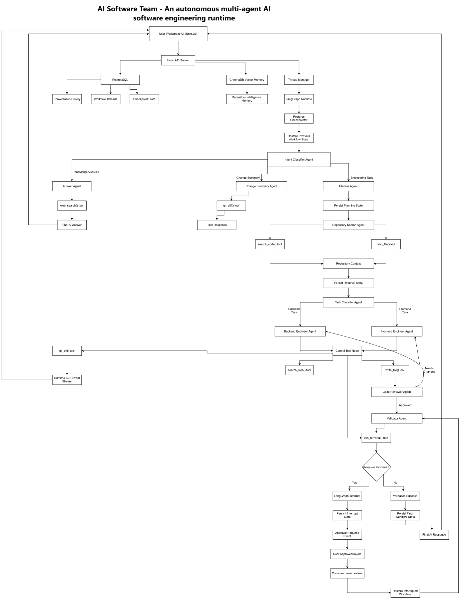

# AI Software Team

An autonomous multi-agent AI software engineering runtime built with LangGraph, TypeScript, Hono, ReactFlow, and real-time orchestration visualization.

This project simulates a real AI engineering organization where specialized agents collaborate to analyze repositories, retrieve code context, modify implementations, validate changes, and stream runtime activity live to the UI.

---

## System Architecture



# Features

## Multi-Agent Architecture

Specialized AI agents collaborate together:

- Intent Classifier
- Strategic Planner
- Repository Searcher
- Task Classifier
- Backend Engineer
- Frontend Engineer
- Reviewer
- Validator
- Change Summary Agent
- Answer Agent

---

## Engineering Memory System

Persistent semantic memory powered by vector embeddings.

The system learns:

- repository architecture
- implementation locations
- framework conventions
- recurring validation failures
- engineering patterns

Memory retrieval is semantic and reusable across executions.

---

## Real-Time Runtime Streaming

Live runtime observability using:

- Server-Sent Events (SSE)
- Event-driven architecture
- Streaming terminal logs
- Streaming tool execution
- Live workflow updates

---

## Dynamic Workflow Visualization

Interactive runtime graph visualization using ReactFlow.

Features:

- active agent highlighting
- real-time execution tracking
- dynamic graph rendering
- orchestration visibility

---

## Tool Calling System

Agents can safely use specialized tools:

### Repository Intelligence Tools

- search_code
- read_file
- grep/search_text

### Engineering Tools

- patch_file
- git_diff
- run_terminal

### Validation Tools

- npm run build
- npm run typecheck
- lint/test execution

---

## Human Approval Gates

Dangerous operations require human approval.

Examples:

- rm commands
- git push
- migrations
- docker operations

The runtime pauses until user approval is provided.

---

## LangGraph Orchestration

Built on top of LangGraph StateGraph.

Features:

- conditional routing
- autonomous loops
- checkpointing
- agent handoffs
- dynamic execution flows

---

# Architecture

## Runtime Flow

```text
User Task
   ↓
Intent Classifier
   ↓
Planner
   ↓
Searcher
   ↓
Task Classifier
   ↓
Frontend / Backend Engineer
   ↓
Reviewer
   ↓
Validator
   ↓
Change Summary
```

---

## Graph Architecture

```text
START
  ↓
intent-classifier
  ↓
planner
  ↓
searcher
  ↓
classifier
  ├── backend-engineer
  └── frontend-engineer
          ↓
reviewer
  ↓
validator
  ↓
change-summary
  ↓
END
```

---

# Memory Architecture

```text
Execution
   ↓
Memory Extraction
   ↓
Embedding Generation
   ↓
Vector Storage
   ↓
Semantic Retrieval
   ↓
Memory Injection
```

The system continuously learns from previous executions.

---

# Tech Stack

## Backend

- TypeScript
- LangGraph
- LangChain
- Hono
- Node.js

## Frontend

- Next.js
- React
- Tailwind CSS
- ReactFlow

## AI / Runtime

- Gemini
- Tool Calling
- Event Streaming
- Multi-Agent Orchestration

## Memory

- ChromaDB
- Vector Embeddings

---

# Runtime Events

The runtime streams events in real-time:

```ts
type RuntimeEvent = "agent" | "tool" | "terminal" | "diff" | "approval" | "log";
```

These events power:

- live logs
- graph visualization
- terminal streaming
- diff viewer
- approval modals

---

# Agent Routing

The system uses conditional routing extensively.

Example:

```ts
.addConditionalEdges(
  "classifier",
  taskRouter
)
```

Routing decisions are dynamically determined by agent reasoning and runtime state.

---

# Project Structure

```bash
src/
├── agents/
├── graph/
├── tools/
├── events/
├── runtime/
├── memory/
├── prompts/
├── server.ts
└── index.ts

web/
├── /app
├── /components
├── /lib
└── /types
```

---

# Getting Started

## Install Dependencies

```bash
npm install
```

---

## Run ChromaDB

```bash
docker run -p 8000:8000 chromadb/chroma
```

---

## Start Backend

```bash
npm run dev
```

---

## Start Frontend

```bash
cd web
npm install
npm run dev
```

---

# Example Tasks

```text
Add auth request logging

Fix Prisma validation issue

Implement dark mode toggle

Add Redis caching layer

Refactor middleware architecture
```

---

# Goals

This project explores:

- autonomous software engineering
- AI orchestration systems
- multi-agent collaboration
- repository intelligence
- durable AI runtimes
- real-time AI observability
- semantic engineering memory

---

# Future Improvements

- LangGraph Interrupts
- Durable Workflow Resumption
- Playwright Browser Agent
- AST-safe Code Editing
- Multi-Repository Intelligence
- Distributed Worker Runtime
- Monaco Diff Visualization
- Kubernetes Runtime Workers
- Autonomous PR Generation

---

# Key Concepts Explored

- Multi-Agent Systems
- Tool Calling
- Semantic Memory
- Runtime Streaming
- Event-Driven Architecture
- Autonomous Loops
- Human-in-the-loop AI
- Vector Retrieval
- Repository Intelligence
- AI Workflow Orchestration

---

# Disclaimer

This project is experimental and designed for learning advanced agentic AI system architecture.

Always review AI-generated code before production usage.

---

# If you like this project

Star the repository and explore autonomous AI engineering systems
